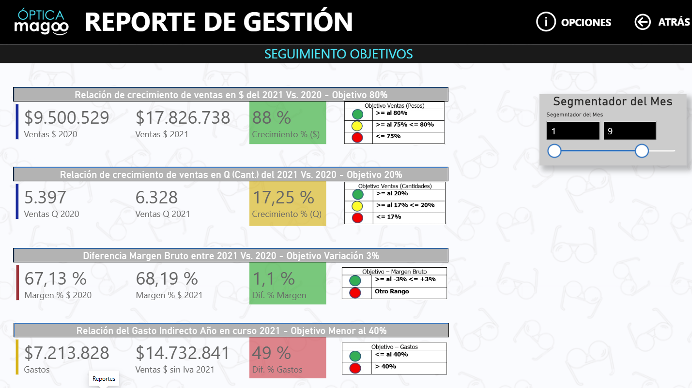
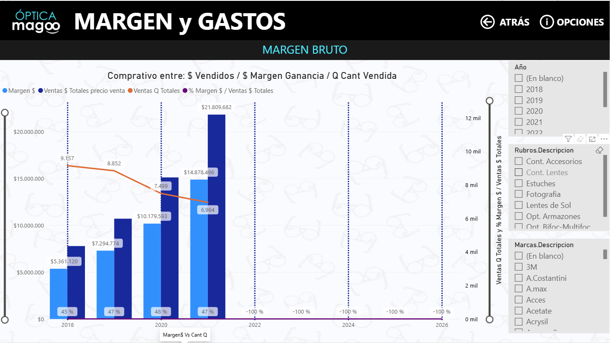
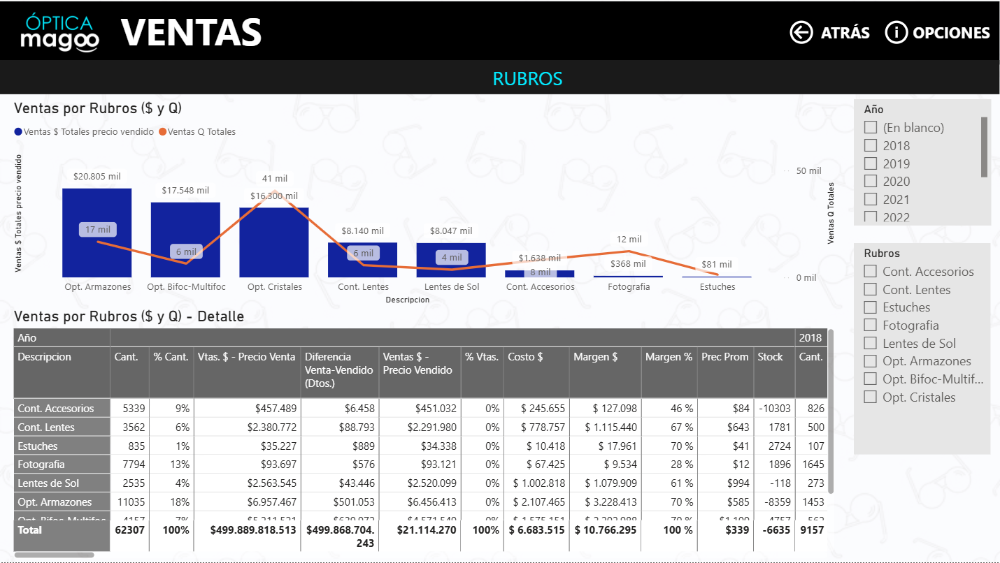
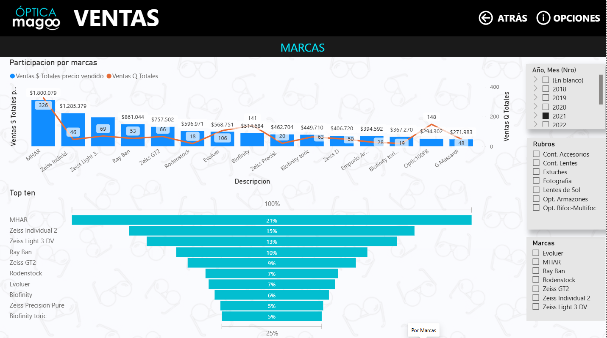
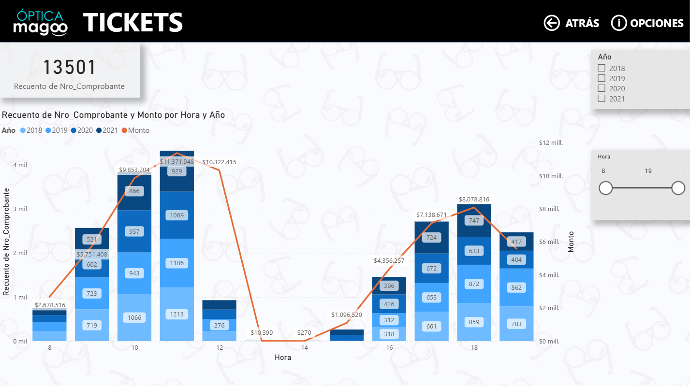
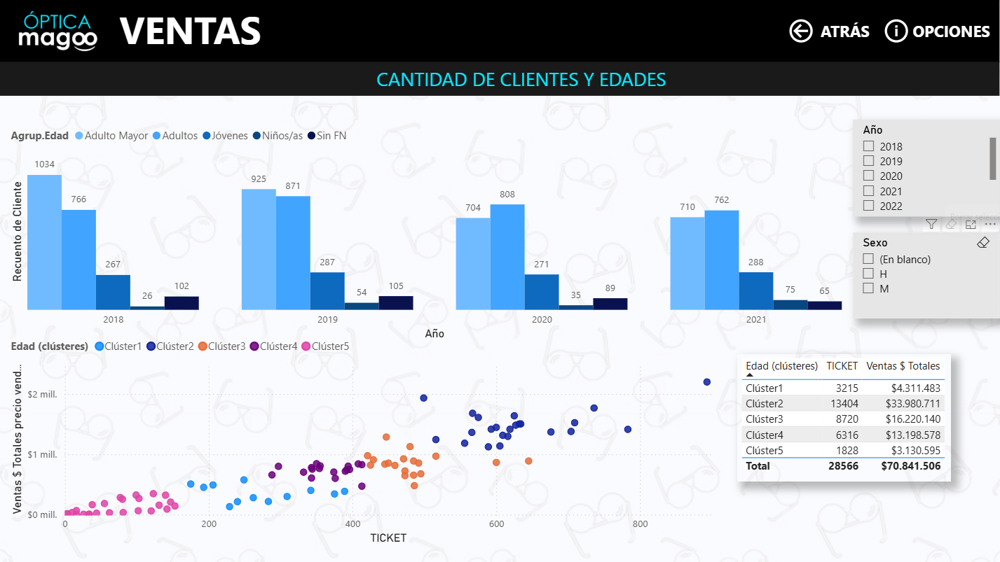
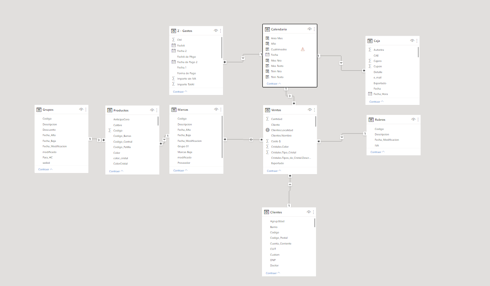

# Tablero de objetivos comerciales para una óptica (Power BI)

*Caso: Óptica Magoo, pyme de la provincia de Buenos Aires.*

> **EN ·** *Team project. Executive Power BI dashboard for a small optical retail business: tracks 2021 targets (sales growth, units, gross margin, fixed costs) with traffic-light alerts across 15 report pages and 88 DAX measures.*

**Trabajo final en equipo (Digital House, Data Analyst, 2021), Grupo 7:** Donato, Villagra, Vecco, Márquez y Schneider.

## Problema
Una óptica de la provincia de Buenos Aires quería una herramienta simple para que su dueño siguiera los objetivos 2021:

| Objetivo | Meta | Tolerancia |
|---|---|---|
| Ventas en $ vs. 2020 | +80 % (50 % inflación + 30 % crecimiento real) | ±5 % |
| Ventas en unidades vs. 2020 | +20 % | ±3 % |
| Margen bruto | Igual al de 2020 | ±3 % |
| Gastos fijos | ≤ 40 % de las ventas | — |

## Qué hicimos
- **15 páginas:** seguimiento de objetivos con semáforos, navegación, margen vs. cantidades, gastos, ventas mensuales, distribución geográfica, rubros, marcas, productos, clientes por rango etario, tickets por horario, stock y días de stock (DOS).
- **88 medidas DAX** agrupadas en una tabla `01Medidas`:
  - ventas en $ y en unidades;
  - promedios móviles de 1 a 12 meses;
  - stock fijado con `CALCULATE` frente a las segmentaciones;
  - días de stock y márgenes;
  - variaciones YoY y MoM.
- **ETL en Power Query** desde la base Access del sistema de gestión, más planillas Excel de gastos:
  - **Integridad referencial:** había ventas con productos y clientes que no estaban en los maestros. Generamos tablas auxiliares con los IDs faltantes y las anexamos a los maestros, para que ninguna venta quedara fuera de los totales.
  - **Gastos:** unificamos cuatro fuentes (gastos, banco, tarjetas y sueldos) en una sola tabla.
  - **Columnas nuevas:** tabla calendario, rangos etarios y jerarquía geográfica.

## Resultados (enero a septiembre de 2021 vs. 2020)

| Objetivo | Resultado | Estado |
|---|---|---|
| Ventas en $ +80 % | **+88 %** ($9,5 M → $17,8 M) | 🟢 |
| Ventas en unidades +20 % | **+17,25 %** (5.397 → 6.328) | 🟡 |
| Margen bruto sin variación (±3 %) | **+1,1 pp** (67,1 % → 68,2 %) | 🟢 |
| Gastos indirectos ≤ 40 % de ventas | **49 %** | 🔴 |

**Lectura:** el crecimiento en pesos superó la meta y el margen se sostuvo, pero los **gastos indirectos fueron el desvío principal**. Las ventas por hora muestran dos picos (11 h y 18 h) y un corte al mediodía, un dato útil para organizar los turnos del personal.

## Capturas

| | |
|---|---|
|  |  |
|  |  |
|  | |

## Modelo de datos

## Privacidad
El dataset es de un negocio real e incluye datos personales de clientes (nombre, domicilio, teléfono). Por eso **el `.pbix` no se publica**: el proyecto se muestra con capturas y documentación. Para publicarlo habría que anonimizarlo antes en Power Query, quitando las columnas personales y reemplazando la fecha de nacimiento por el rango etario.

## Qué mejoraría hoy
Revisando el tablero en 2026 con mirada de calidad de datos:
- **Eje temporal hasta 2026 con "-100 %":** la tabla calendario va más allá de los datos y la medida de % de margen devuelve -100 % en los años vacíos. Hay que limitar el calendario al rango de ventas, o hacer que la medida devuelva `BLANK()` cuando no hay ventas.
- **Totales inconsistentes en "Ventas por rubro":** el total de "Vtas. $ - Precio Venta" (≈ $499.890 M) no es coherente con "Ventas $ - Precio Vendido" (≈ $21 M). Además, "% Vtas." muestra 0 % en todas las filas y el total de "Margen %" muestra 100 %. Apunta a un precio de lista atípico y a medidas que no se comportan bien en los totales: hace falta un control de outliers y revisar la medida a nivel total.
- **Stock negativo** en varios rubros (por ejemplo, Accesorios: -10.303). Es una señal de movimientos de stock incompletos en el origen; correspondía validarlo antes de mostrarlo.
- **Dos definiciones de margen:** la página de objetivos muestra ≈ 67 % y la de margen bruto ≈ 47 %. Probablemente una es sin IVA o usa otro período, pero el tablero no lo aclara. Cada KPI debería tener una definición única y documentada.
- Una relación Marcas ↔ Ventas es **muchos a muchos y bidireccional**. Conviene resolverla con una tabla puente o una dimensión de producto que incluya la marca, para evitar ambigüedad en los filtros.
- Mover la limpieza a una capa previa (SQL o dataflow) y dejar en Power BI solo el modelo semántico.

## Archivos
- `informe-optica-magoo.pdf`: documento del proyecto, con objetivos, estrategia de medición y fórmulas de los KPIs.
- `assets/`: diagrama del modelo y capturas del tablero (sin datos personales).

